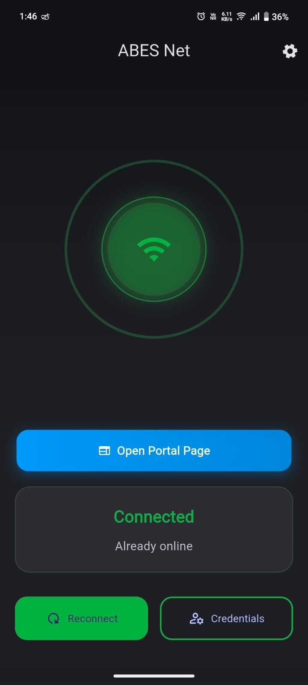
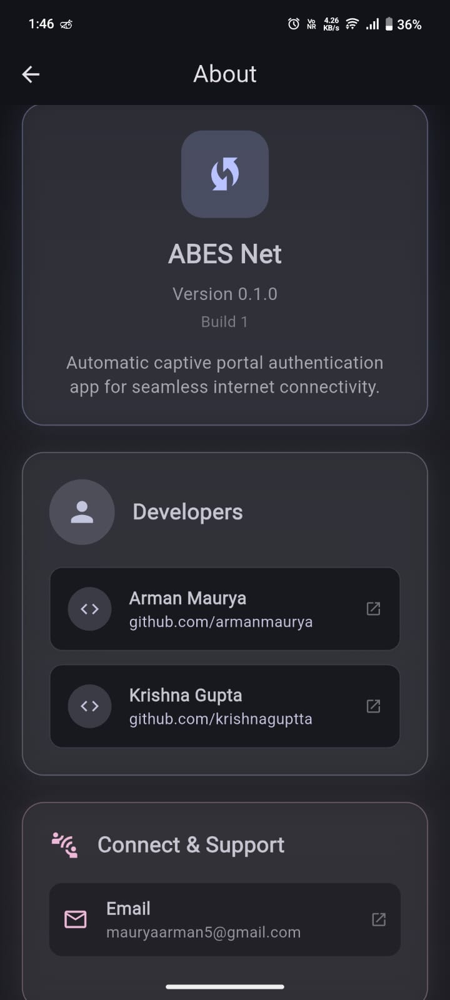
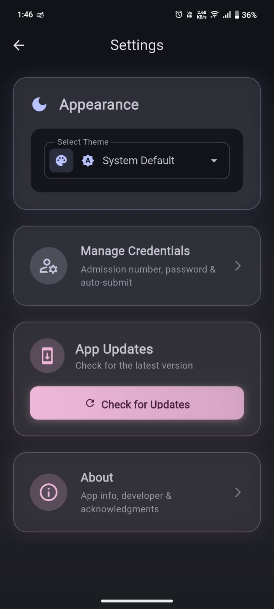
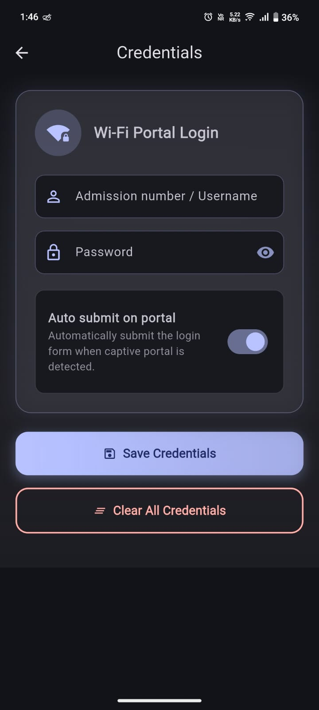

# ABES Net

This Flutter app automates captive-portal login to a gateway at `192.168.1.254:8090` by:
- Probing internet with `http://www.gstatic.com/generate_204`.
- Attempting a direct background POST to `https://192.168.1.254:8090/login.xml` (fallback to HTTP if needed).

## Features
- Securely stores credentials using KeyStore/Keychain.
- Manual "Reconnect" trigger and status view.
- Background auto-connect via WorkManager (periodic + connectivity-triggered one-off).

## Setup
1. Install Flutter and Android toolchain.
2. From this folder run:

```pwsh
flutter pub get
flutter run -d android
```

Open Settings to save your username/password, then tap Reconnect (or wait for background worker). The app does direct POST login only; no portal UI is opened.

## Android permissions
Configured in `android/app/src/main/AndroidManifest.xml`:
- `INTERNET`, `ACCESS_NETWORK_STATE`, `ACCESS_WIFI_STATE`, `FOREGROUND_SERVICE`, `RECEIVE_BOOT_COMPLETED`
- `android:usesCleartextTraffic="true"` to allow HTTP `generate_204` interception.

## Background behavior

Android background work is scheduled via WorkManager. The app registers:
- A periodic task every 15 minutes that probes connectivity and attempts direct POST login when offline (lightweight, battery-friendly).
- A one-off task that runs as soon as network connectivity is available. It re-enqueues itself after each run so it fires again on the next connectivity event. This enables reconnect even if the app is not opened.

Tips for reliability (varies by OEM):
- Exempt the app from Battery Optimization and allow Background Activity.
- Keep Wi‑Fi “Always on” during sleep if your device supports it.

## Notes
- If your gateway host differs, update `AuthService.baseHost`.

## Screenshots

Below are some screenshots of the app in action:

<div align="center">
	
	<br><sub>Login Screen</sub>
	<br><br>
	
	<br><sub>Status View</sub>
	<br><br>
	
	<br><sub>Settings</sub>
	<br><br>
	
	<br><sub>Background Worker</sub>
</div>
